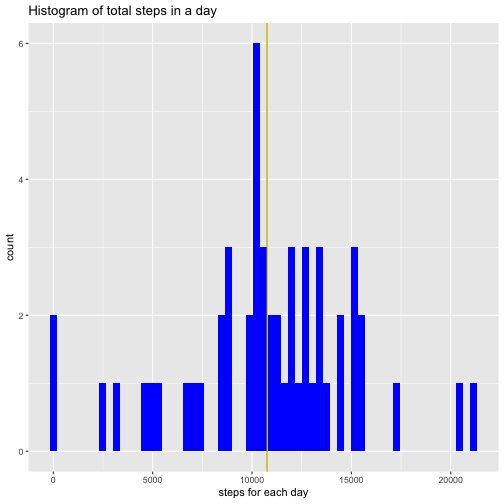
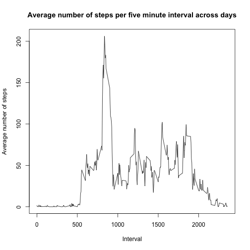
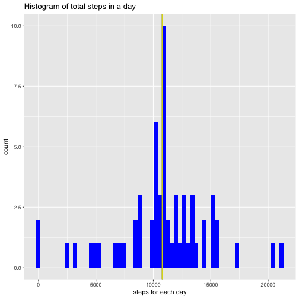
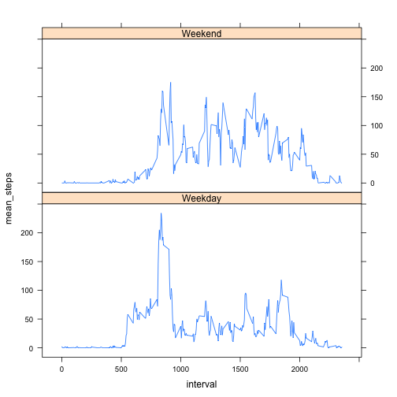

---
output:
  html_document: default
  pdf_document: default
---
# PA1 template R markdown file


```r
knitr::opts_chunk$set(echo = TRUE)
```


First, I will load the data.

```r
activity <- read.csv("activity.csv")
```


Question: What is the mean total number of steps taken in a day?
First I will group by the date and make a table of the total steps per day. Then I will find the mean of all the total number of steps per day. 


```r
library(dplyr)
library(ggplot2)
steps_per_day <- activity %>% group_by(date) %>% summarise(steps_day = sum(steps))
dim(steps_per_day)
```

```
## [1] 61  2
```

```r
mean(steps_per_day$steps_day, na.rm = TRUE)
```

```
## [1] 10766.19
```

```r
median(steps_per_day$steps_day, na.rm = TRUE)
```

```
## [1] 10765
```
The mean total number of steps taken in a day is 10766.19 steps. Median is 10765.

```r
ggplot(steps_per_day, aes(x= steps_day)) + geom_histogram(bins = 61, fill = "blue") + labs(x="steps for each day", title = "Histogram of total steps in a day") + geom_vline(aes(xintercept = mean(steps_day, na.rm= TRUE)), colour="black") + geom_vline(aes(xintercept = median(steps_day, na.rm= TRUE)), colour = "yellow")
```

```
## Warning: Removed 8 rows containing non-finite values (stat_bin).
```




Questions: What is the average daily activity pattern?

Make a time series plot of the 5-minute interval (x-axis) and the average number of steps taken, averaged across all days (y-axis)?


```r
mean_interval <- activity %>% group_by(interval) %>% summarise(mean_steps = mean(steps, na.rm = TRUE))
with(mean_interval, plot(interval, mean_steps, type= "l", xlab = "Interval", ylab = "Average number of steps", main = "Average number of steps per five minute interval across days")) 
```




Which 5-minute interval, on average across all the days in the dataset, contains the maximum number of steps?


```r
maximum <- max(mean_interval$mean_steps, na.rm = TRUE)
mean_interval %>% dplyr::filter(mean_steps == maximum)
```

```
## # A tibble: 1 x 2
##   interval mean_steps
##      <int>      <dbl>
## 1      835       206.
```
The five minute interval with the greatest mean steps is interval 835.


Question: Imputing missing values
Calculate and report the total number of missing values in the dataset (i.e. the total number of rows with NAs)


```r
sum(is.na(activity$steps))
```

```
## [1] 2304
```
Total number of missing values is 2304.

Next, I devised a strategy for filling in all of the missing values in the dataset. 

I used the mean for that 5-minute interval accross all days to impute missing values.
Then, I created a new dataset that is equal to the original dataset but with the missing data filled in. 


```r
activity2 <- as_tibble(activity)
activity2 <- full_join(activity2, mean_interval, by = "interval")

na_idx <- which(is.na(activity2$steps))

activity2[na_idx, 1] <- activity2[na_idx, 4]
activity2 <- activity2[,1:3]
View(activity2)
```


Make a histogram of the total number of steps taken each day and report the mean and median total number of steps taken per day. Do these values differ from the estimates from the first part of the assignment? 


```r
library(dplyr)

steps_per_day2 <- activity2 %>% group_by(date) %>% summarise(steps_day = sum(steps))

mean(steps_per_day2$steps_day, na.rm = TRUE)
```

```
## [1] 10766.19
```

```r
median(steps_per_day2$steps_day, na.rm = TRUE)
```

```
## [1] 10766.19
```

```r
ggplot(steps_per_day2, aes(x= steps_day)) + geom_histogram(bins = 61, fill = "blue") + labs(x="steps for each day", title = "Histogram of total steps in a day") + geom_vline(aes(xintercept = mean(steps_day, na.rm= TRUE)), colour="black") + geom_vline(aes(xintercept = median(steps_day, na.rm= TRUE)), colour = "yellow")
```



What is the impact of imputing missing data on the estimates of the total daily number of steps? 


```r
mean(steps_per_day$steps_day, na.rm = TRUE) # mean without missing values
```

```
## [1] 10766.19
```

```r
median(steps_per_day$steps_day, na.rm = TRUE) # median without missing values
```

```
## [1] 10765
```

```r
mean(steps_per_day2$steps_day, na.rm = TRUE) # mean after imputing missing
```

```
## [1] 10766.19
```

```r
median(steps_per_day2$steps_day, na.rm = TRUE) # median after imputing missing values
```

```
## [1] 10766.19
```
Median is slightly different, but the mean is the same. 


Question: Are there differences in activity patterns between weekdays and weekends?
Use the dataset with the filled-in missing values for this part.
Create a new factor variable in the dataset with two levels – “weekday” and “weekend” indicating whether a given date is a weekday or weekend day.

```r
activity$date <- as.Date(activity$date)
activity3 <- activity %>% mutate(weekend = weekdays(activity$date))
activity3$weekend <- factor(activity3$weekend, levels = c("Monday", "Tuesday", "Wednesday", "Thursday", "Friday", "Saturday", "Sunday"),  labels = c("Weekday", "Weekday", "Weekday", "Weekday", "Weekday", "Weekend", "Weekend"))
```


Make a panel plot containing a time series plot (i.e. type="l") of the 5-minute interval (x-axis) and the average number of steps taken, averaged across all weekday days or weekend days (y-axis). See the README file in the GitHub repository to see an example of what this plot should look like using simulated data.

```r
weekend_weekday <- activity3 %>% group_by(weekend, interval) %>% summarise(mean_steps = mean(steps, na.rm= TRUE))


library(lattice)
xyplot(mean_steps ~ interval | weekend, data = weekend_weekday, type= "l", layout = c(1,2))
```



